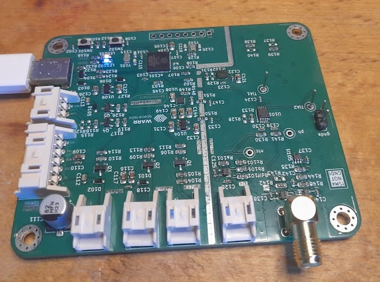
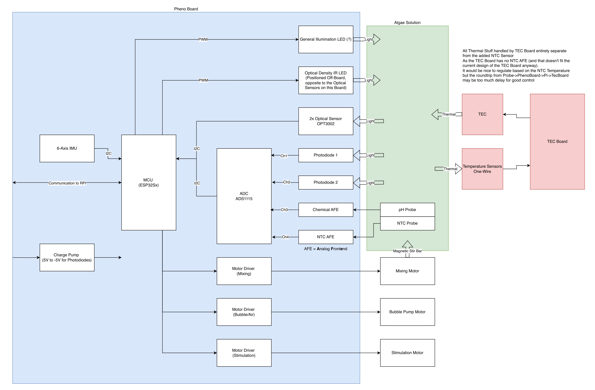

# Phenobottle Sensorboard
## Getting Startet
- Connect via USB or USART0 to access a internal console.
  A good, easy to use Tool for this is the Arduino IDE. 
- Send "?" to this console for help on the avaliable commands.

## Picture

## Software Setup
Software is managed with plattformio.

## Hardware Interfaces

